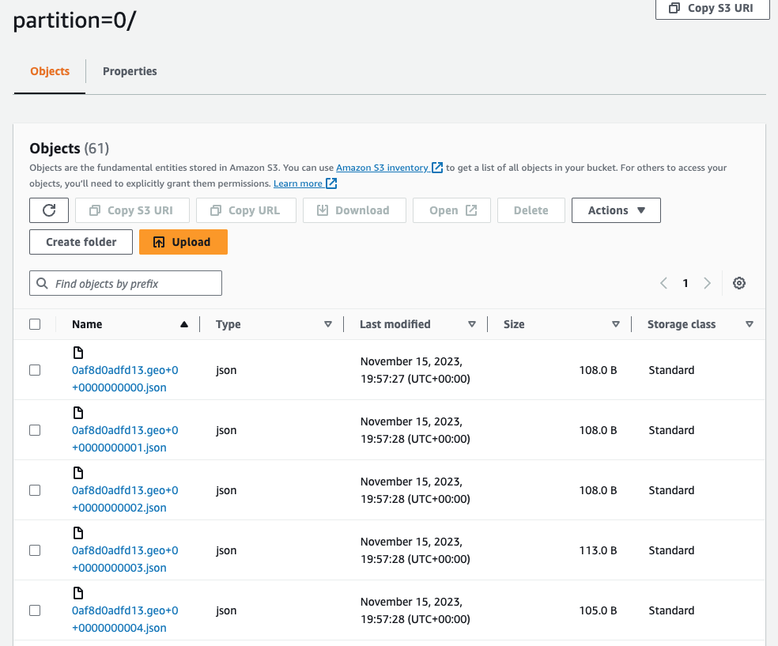

# pinterest-data-pipeline218

Pinterest crunches billions of data points every day to decide how to provide more value to their users. In this project, we are creating a similar system using the AWS Cloud.

## Initial explorations

We modified the supplied `user_posting_emulation.py` script by writing the contents to a file. To do this we needed to force the json to output information in strings only, as datetimes are used in two of the three tables that are used.

These are:

- `pinterest_data` data about posts updated to Pinterest

```yaml
{
  "index": 7528,
  "unique_id": "fbe53c66-3442-4773-b19e-d3ec6f54dddf",
  "title": "No Title Data Available",
  "description": "No description available Story format",
  "poster_name": "User Info Error",
  "follower_count": "User Info Error",
  "tag_list": "N,o, ,T,a,g,s, ,A,v,a,i,l,a,b,l,e",
  "is_image_or_video": "multi-video(story page format)",
  "image_src": "Image src error.",
  "downloaded": 0,
  "save_location": "Local save in /data/mens-fashion",
  "category": "mens-fashion",
}
```

- `geolocation_data` data about the location of each post

```yaml
{
  "ind": 7528,
  "timestamp": "2020-08-28 03:52:47",
  "latitude": -89.9787,
  "longitude": -173.293,
  "country": "Albania",
}
```

- `user_data` data about the user that updates the post.

```yaml
{
  "ind": 7528,
  "first_name": "Abigail",
  "last_name": "Ali",
  "age": 20,
  "date_joined": "2015-10-24 11:23:51",
}
```

We note the index number is `ind` in geo and user but `index` in pin.

## AWS

Using a supplied IAM username and password, we logged in to AWS. A .pem key file was created to allow us to connect to a preinstalled ec2 instance.

## Kafka

We installed Kafka on the ec2 instance. This required the installation of java on the Amazon Linux instance and the downloading of Kafka 2.12-2.8.1, as this is needed for the presupplied cluster.

We installed the latest version of the IAM MSK authentication package from https://github.com/aws/aws-msk-iam-auth and installed this in the lib directory of the Kafka installation. The trust policy for our ec2 client was edited using the IAM console, and then the arn for the role we had created was included in the client.properties file that is located in the bin directory.

Three Kafka topics were created using the following template:

    ./kafka-topics.sh --bootstrap-server $BOOTSTRAP_SERVER_STRING --command-config client.properties --create --topic $MY_AWS_USERNAME.pin

These are the 3 topics that were created:

    - 0af8d0adfd13.geo
    - 0af8d0adfd13.pin
    - 0af8d0adfd13.user

This was verified by running

    ./kafka-topics.sh --bootstrap-server $BOOTSTRAP_SERVER_STRING --command-config client.properties --list

We created a connection from the MSK cluster to an S3 bucket by first creating a customer plugin in MSK Connect. We downloaded and copied the Confluent.io Amazon S3 connector and copied it into our S3 bucket, and then created the custom plugin using the name <userid>-plugin. We then created a connector, using our <userid>-ec-access-role for authentication to the cluster, and the following connector configuration:

```
connector.class=io.confluent.connect.s3.S3SinkConnector
s3.region=us-east-1
flush.size=1
schema.compatibility=NONE
tasks.max=3
topics.regex=<userid>.*
format.class=io.confluent.connect.s3.format.json.JsonFormat
partitioner.class=io.confluent.connect.storage.partitioner.DefaultPartitioner
value.converter.schemas.enable=false
value.converter=org.apache.kafka.connect.json.JsonConverter
storage.class=io.confluent.connect.s3.storage.S3Storage
key.converter=org.apache.kafka.connect.storage.StringConverter
s3.bucket.name=user-<userid></userid>-bucket
```

### Batch processing: configuring an API in API Gateway

In API Gateway, we create a `/{proxy+}` resource. CORS was enabled and a HTTP method was then added. We supplied as the Endpoint URL the PublicDNS from our ec2 instance. The API was then deployed using Invoke URL, which we stored for use later in our pipeline. Of note is that we must specify the endpoint using `http` and not `https`, even though it defaults to https when copying from AWS (this was the cause of much debugging!) The endpoint will be the main means of communicating with our kafka rest proxy and takes the form `http://KafkaClientEC2InstancePublicDNS:8082/{proxy}`

We then installed the Confluent package for the Kafka REST Proxy on our ec2 instance. For this we modified the `kafka-rest.properties` file by adding `bootstrap.servers` and `zookeeper.connect` variables. As we had already installed the `aws-msk-iam-auth` in our $CLASSPATH we had no need to this again, but we added the following to the file, where `client` was used:

```
# Sets up TLS for encryption and SASL for authN.
client.security.protocol = SASL_SSL

# Identifies the SASL mechanism to use.
client.sasl.mechanism = AWS_MSK_IAM

# Binds SASL client implementation.
client.sasl.jaas.config = software.amazon.msk.auth.iam.IAMLoginModule required awsRoleArn="Your Access Role";

# Encapsulates constructing a SigV4 signature based on extracted credentials.
# The SASL client bound by "sasl.jaas.config" invokes this class.
client.sasl.client.callback.handler.class = software.amazon.msk.auth.iam.IAMClientCallbackHandler
```

The REST proxy is started by the following:

```
./kafka-rest-start /home/ec2-user/confluent-7.2.0/etc/kafka-rest/kafka-rest.properties
```

#### Sending data to the API using Python

Using the supplied `user_posting_emulation.py` script we modified this as `user_posting_emulation_kafka.py`. The basis of communicating with the REST proxy is the following:

```
invoke_url = "https://YourAPIInvokeURL/YourDeploymentStage/topics/YourTopicName"
#To send JSON messages you need to follow this structure
payload = json.dumps({
    "records": [
        {
        #Data should be send as pairs of column_name:value, with different columns separated by commas
        "value": {"index": df["index"], "name": df["name"], "age": df["age"], "role": df["role"]}
        }
    ]
})

headers = {'Content-Type': 'application/vnd.kafka.json.v2+json'}
response = requests.request("POST", invoke_url, headers=headers, data=payload)
```

One issue of concern was that we tested sending items to the cluster, but that these did not take the form of json objects in the first instance. This necessitated rebuilding the connector and flushing the kafka topics. So for this project we need to be mindful to keep to the specified formats for data.

We incorporated the above code into the posting emulation script. The most complicated factor were `datetime` objects, which json does not handle natively. We dealt with this by writing the following function, which returned a string for any instances od datetime objects:

```
def datetime_handler(obj):
    if isinstance(obj, (datetime, date, time)):
        return str(obj)
```

And specifying the `default=datetime_handler` argument in the `json.dumps` payload after the main dictionary was sent.

We then set up three Kafka consumers, one per topic, to accept the messages that were sent to the REST proxy. These were of the format:

```
./kafka-console-consumer.sh --bootstrap-server $BOOTSTRAP_STRING --consumer.config client.properties --topic $MY_USER_NAME.geo --from-beginning --group students
```

An example output from the consumer:

```
[ec2-user@ip-172-31-47-135 bin]$ ./kafka-console-consumer.sh --bootstrap-server $BOOTSTRAP_STRING --consumer.config client.properties --topic $MY_USER_NAME.geo --from-beginning --group students
OpenJDK 64-Bit Server VM warning: If the number of processors is expected to increase from one, then you should configure the number of parallel GC threads appropriately using -XX:ParallelGCThreads=N
{"ind":7528,"timestamp":"2020-08-28 03:52:47","latitude":-89.9787,"longitude":-173.293,"country":"Albania"}
{"ind":2863,"timestamp":"2020-04-27 13:34:16","latitude":-5.34445,"longitude":-177.924,"country":"Armenia"}
{"ind":5730,"timestamp":"2021-04-19 17:37:03","latitude":-77.015,"longitude":-101.437,"country":"Colombia"}
{"ind":8304,"timestamp":"2019-09-13 04:50:29","latitude":-28.8852,"longitude":-164.87,"country":"French Guiana"}
{"ind":8731,"timestamp":"2020-07-17 04:39:09","latitude":-83.104,"longitude":-171.302,"country":"Aruba"}
{"ind":1313,"timestamp":"2018-06-26 02:39:25","latitude":77.0447,"longitude":61.9119,"country":"Maldives"}
```

This was then reflected in the S3 bucket store, where they were stored `topics/<your_UserId>.pin/partition=0/`:



## Batch Processing: Databricks

In order to clean and query the data, we will be reading from our S3 bucket to Databricks. To do this we used the file `Mount S3 bucket.ipynb`, which is a Workbook we used in Databricks. This reads an `authentication_credentials.csv` file which was generated from the IAM user settings in AWS. We then extract the relevant details from this file and use them as constants we can use to create dataframes. A function was created to read the three json files:

```
def make_dataframe(table_name):
    ''' Makes a dataframe for each of the data buckets in the S3 bucket for pin, geo and user

    Argument:   table_name (string)
    Returns:    dataframe
    '''

    file_location = f"/mnt/$MY_USERNAME-bucket/topics/0af8d0adfd13.{table_name}/partition=0/*.json"
    # you need to remember to put in the partition=0 bit!
    file_type = "json"
    # Ask Spark to infer the schema
    infer_schema = "true"
    # Read in JSONs from mounted S3 bucket
    df = spark.read.format(file_type) \
    .option("inferSchema", infer_schema) \
    .load(file_location)
    return df

```

We used this function to create three dataframes, one for each of the user, pin and geo buckets we created from the Kafka cluster.

### Batch Processing: Spark on Databricks

Using Databricks and Spark SQL, we cleaned the data for each of the three tables we had loaded, namely the pin table, the user table and the geo table. This involved some basic analysis of the tables, looking for values which did not cohere with others, Nulls values, and garbage values. We also ensured that columns had the appropriate data type, which included casting columns and converting to timestamp where appropriate. For the geo table, we combined the longitude and latitude columns into a co-ordinates table, and we did the same in the user table with first_name and last_name to create user_name.

We then performed a series of queries which answered questions of the data. Using the ability of Spark and Databricks to use SQL, we decided to write these queries in SQL. We will also, at a later date, do these in Spark SQL. These may be found in our notebooks on Databricks as `Cleaning data and Queries`.

One issue was how to deal with median values, as SQL has no inbuilt function for this. We decided to use percentiles, and use `approx_percentile` to calculate this. Sometimes this does not give the median, but the value adjacent to the median. The way around this is to count rows and write a function to handle this, but at the current time there are NULL values in the data and this prevents us from using this effectively. It may be we return to this before the end of the project and refactor this part of the project. Nevertheless, the logic in the SQL queries does address the batch processing needs of the data as it is.

Because of some issues with the user_emulation script, we only have around 1500 rows of the data set, so we are missing more recent data. This had an effect on some of the later queries asking about the years 2015-2020, because our data only reaches 2017.

### Batch Processing: AWS AMAA

Using the MWAA environment and its S3 bucket, the already configured API token and requirements.txt file, we created a Airflow DAG to run our Spark Databricks notebook. One issue we encountered was that the task was notified as having been successful but wasn't actually running - this was due to the date being set in the future (only one day, but nevertheless it prevented us from properly testing it until we reached that day). We specified that it would run daily. In order to het the right filepath to use in the DAG we used the following command in Databricks:

`dbutils.notebook.entry_point.getDbutils().notebook().getContext().notebookPath().get()`

And here is the DAG which we used (note the date was the issue with our task not actually starting).

```
with DAG('0af8d0adfd13_dag',  # I think this is what I'm supposed to do, changed from databricks_dag, which was the filename
         # should be a datetime format
         start_date=datetime(2023, 11, 26),
         # check out possible intervals, should be a string
         schedule_interval='@daily',
         catchup=False,
         default_args=default_args
         ) as dag:

        opr_submit_run = DatabricksSubmitRunOperator(
        task_id='submit_run',
        # the connection we set-up previously
        databricks_conn_id='databricks_default',
        # which cluster do we use? spark.conf.get("spark.databricks.clusterUsageTags.clusterId")
        existing_cluster_id='CLUSTER_NAME',
        notebook_task=notebook_task
    )
    opr_submit_run

```

We manually triggered the DAG on the MWAA Airflow UI, and scheduled it to run daily and it ran successfully for over 7 days.

### Stream Processing: AWS Kinesis

In AWS Kinesis we created the following streams:

```
    streaming-0af8d0adfd13-geo
    streaming-0af8d0adfd13-user
    streaming-0af8d0adfd13-pin
```

We then configured our previously created REST API in AWS API Gateway to invoke Kinesis actions. This involved making use of the [following tutorial](https://docs.aws.amazon.com/apigateway/latest/developerguide/integrating-api-with-aws-services-kinesis.html). Making use of an already created IAM Role and Policy for Kinesis `arn:aws:iam::<MYACCOUNTNAME>:role/0af8d0adfd13-kinesis-access-role`, we created an API with the following structure:

```

    /
        /streams
        GET
            /{stream-name}
            DELETE
            POST
            GET
                /records
                GET
                PUT
                /record
                PUT
```

The ListStreams action in Kinesis was use for GET under `/streams`. CreateStream, DescribeStream, or DeleteStream action were used in `/streams/{stream-name}`. And GetRecords or PutRecords (including PutRecord) action in Kinesis were in `/streams/{stream-name}/records` and `/streams/{stream-name}/record` (PUT only).

We then modified the existing user_posting_emulation.py script to use similar code for what we used for the Kafka ingestion, creating a similar function send_to_kinesis.

```
def send_to_kinesis(my_dict, stream, partition_key):
    ''' Sends my_dict info to the Kinesis stream specified

    Parameters: my_dict (dictionary)
                stream (string)
    '''

    invoke_url = f"https://MYAPIURL/MYSTAGE/streams/{stream}/record"

    keys_list = my_dict.keys()
    values_dict = {}
    for k in keys_list:
        values_dict[k] = my_dict[k]

    # To send JSON messages you need to follow this structure
    payload = json.dumps({
        "StreamName": stream,
        "Data": values_dict,
        "PartitionKey": partition_key
    }, default=datetime_handler)

    headers = {'Content-Type': 'application/json'}

    response = requests.request(
        "PUT", invoke_url, headers=headers, data=payload)
```

If we were to further refactor this project, we could considate these two into one module. However, we decided not to do this in this instance as the code exists separately in files that don't current cohere. As future work we could work on this and follow the OOP structure of our previous project.

We then created a new notebook in Databricks `Kinesis_Processing`, which is similar to our `BatchProcessingFinal` script which was scheduled to run using the DAG in Airflow. However in this case we are adapting it to run as a stream rather than as a batch.

First of all, we needed to ingest the streams into the notebook. We used the following function to do this, with an example of how we used it:

```
def get_stream(stream_suffix):
    '''Gets the Kinesis stream with the suffix supplied in name

    Parameter: name (string)
    Returns: stream that needs serialised and which requires a struct

    '''
    return spark \
        .readStream \
        .format('kinesis') \
        .option('streamName',f'streaming-0af8d0adfd13-{stream_suffix}') \
        .option('initialPosition','earliest') \
        .option('region','us-east-1') \
        .option('awsAccessKey', ACCESS_KEY) \
        .option('awsSecretKey', SECRET_KEY) \
        .load()


stream_geo = get_stream('geo')
stream_pin = get_stream('pin')
stream_user = get_stream('user')
```

However, this is not sufficient, as it was in the Batch processing, for manipulation. We need to deserialise the `data` value in each stream and then apply the appropriate schema so that we can create dataframes that can be processed. Here is an example of how we constructed on of the struct schemas:

```
struct_geo = StructType().add("ind", IntegerType())\
    .add("timestamp", TimestampType())\
    .add("latitude", FloatType())\
    .add("longitude", FloatType())\
    .add("country", StringType())
```

We then created a dataframe by applying this schema to the streamed dataframe we had to create a dataframe with the requisite types that we can then use in our cleaning pipeline. The deserialisation occurs when we `cast (data as string) jsonData`, and then we use `from_json` to take these strings and convert them into the types we specified in our schema, eg `struct_geo`:

```
def create_dataframe(stream_name, struct_name):
    ''' Creates a dataframe from the stream supplied using the struct values
    Parameters:
        stream_name (string)
        struct_name (string)
    Returns:
        dataframe
    '''

    return stream_name.selectExpr("cast (data as STRING) jsonData").select(from_json("jsonData", struct_name).alias("our_data")).select("our_data.*")
```

We ran the `user_posting_emulation_streaming.py` file to ingest data to Kinesis. One problem we had was that once data is in a Kinesis stream you cannot delete it until the end of the data retention period. Due to a typo, I mistakenly ingested the data from the user table into all three streams. This meant I then had to add a line in the notebook which deleted rows which had all nulls except for the index - this is a useful thing to do for data cleaning anyway, so I kept it afterwards. This is similar to a problem I had with Kafka earlier in the project where it was not possible to flush out test data I had innocently sent which then prevented my scripts from operating as they didn't have the expected structure.

Once ingested, we use exactly the same cleaning functions as we did for batch processing. Again, if we were to extend this project we would probably want to modularise the code to prevent any futuer errors occuring. Finally, we save each stream to a Delta Table in Databricks. We used the following function for this:

```
def write_dataframe(df, name):
    ''' Write stream dataframe in a delta table
    Parameters:
        df (string): the dataframe name
        name: name that needs to be used, one of geo, user or pin
    '''
    df.writeStream \
    .format("delta") \
    .outputMode("append") \
    .option("checkpointLocation", "/tmp/kinesis/_checkpoints/") \
    .table(f"0af8d0adfd13_{name}_table")

```

Thus we created a pipeline that emulates the data pipeline for Pinterest, which performs batch and stream processing and which makes use of the AWS API Gateway, AWS S3 storage and AWS Kafka (for batch processing), AWS Kinesis (for Stream Processing) and Spark SQL and PySpark in Databricks for data cleaning.
